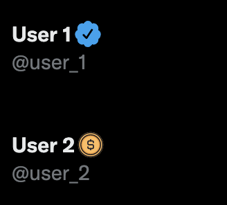

# Blue Tick

"Blue Tick" is a chrome extension which restores authentic blue ticks and distinguishes between actual verified account and paid subscribers.

**User 1** - Verified Blue Tick  
**User 2** - Paid ($8) Blue Tick

## Development 

If you find this extension helpful star this project.

### Available Commands

| Commands | Description |
| --- | --- |
| `npm run start` | build extension, watch file changes |
| `npm run build` | generate release version |
| `npm run docs` | generate source code docs |
| `npm run clean` | remove temporary files |
| `npm run test` | run unit tests |
| `npm run sync` | update config files |

