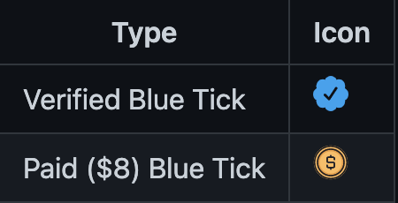
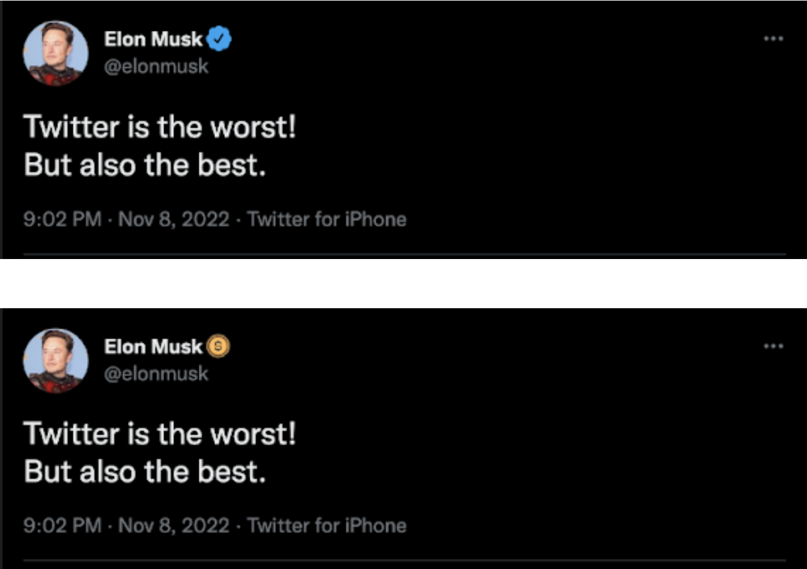
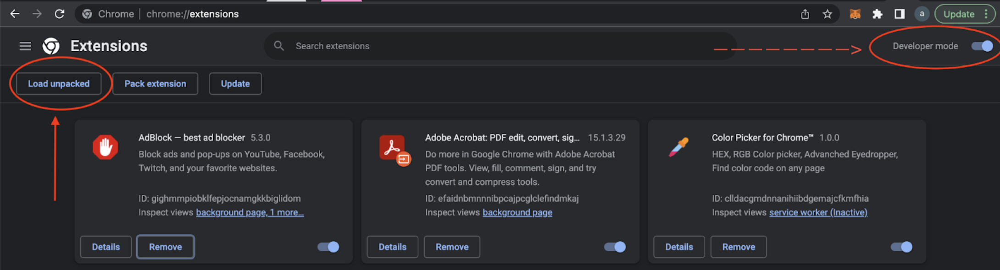
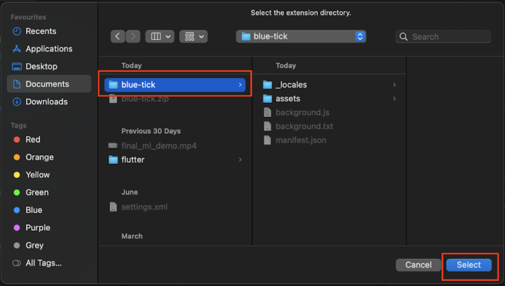
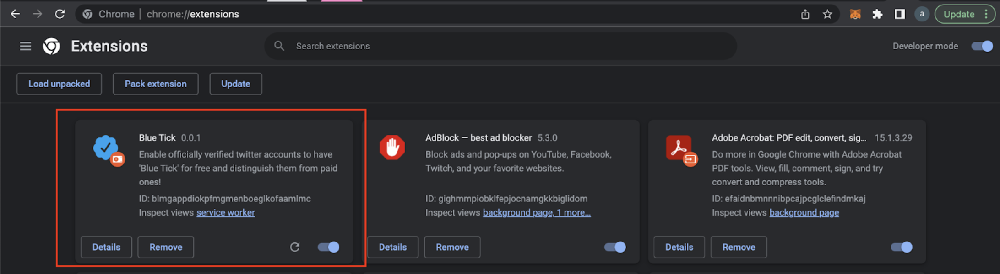
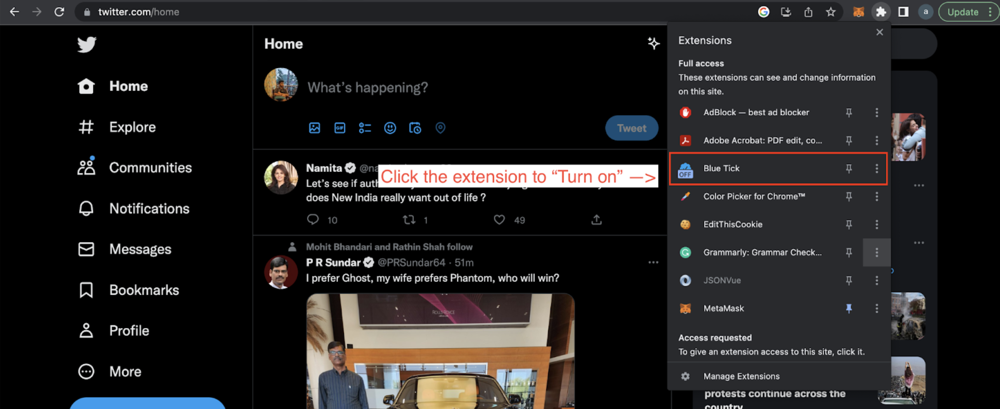

# Blue Tick

"Blue Tick" is a chrome extension which restores authentic blue ticks and distinguishes between actual verified account and paid subscribers.

**If you find this extension helpful, star this project.**

[comment]: <> (![image info]&#40;./assets/img/tweetified_snap.png&#41;)

 

## Instructions
Steps To Install and Use the Extension:

1. Download the extension from this link: https://github.com/amangupta25/blue-tick/raw/main/blue-tick.zip
2. Unzip the downloaded file
3. Navigate to chrome://extensions
4. At the top right, turn on Developer mode   
   
5. Click Load unpacked and select the unzipped folder   

  
6. Open a new tab and log in to your twitter account:  https://twitter.com/
7. Turn on the “Blue Tick” extension by clicking on the extension icon
  
   
